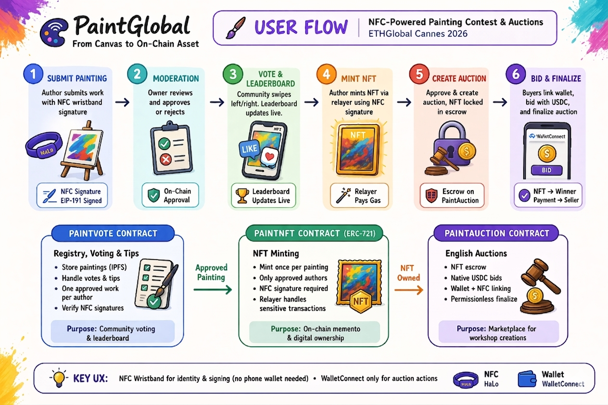
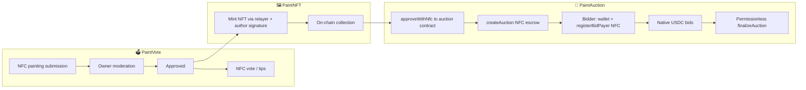

<div align="center">

# 🎨 PaintGlobal

<p>
  
  
  
  
  
  
</p>

</div>

> 🖼️ Built for **ETHGlobal Cannes 2026** to turn the **painting workshop** into an on chain contest and auction room using **wristband chips**. Participants who painted during the session **show off their work** in a web app, chase reactions with **Tinder-style voting** (way more fun than a static gallery wall), and see who wins the room via an on-chain **leaderboard**. **Publishing** (after moderation) unlocks an **NFT** tied to the canvas, and optionally an **auction** later—**Web3 as a souvenir and a game layer** on top of brushes and easels, not a lecture. Everything hinges on an **NFC wristband (HaLo)**: signing and author identity without forcing a wallet on the painter’s phone. (**except for auctions actions**)

---

### 📑 Contents

| | |
|:---|:---|
| [🎭 Product context](#product-context-cannes--workshop) | [🧱 Technical architecture](#technical-architecture-summary) |
| [🛠️ Tech stack](#tech-stack) | [🔁 User flow](#user-flow-overview) |
| [🚀 Contract deployment](#contract-deployment-order) | [👥 Contributors](#contributors) |

---

## 🎭 Product context (Cannes & workshop)

The painting workshop was already a **hit** with hackers: a rare moment away from the keyboard, something tactile and social. The bet with PaintGlobal was to **carry that energy online** and add a **light, cheeky Web3 dimension**—swipes, ranks, a wristband that feels like a **badge**, an NFT that reads like a **trophy** from the session.

During the hackathon, the product goal stays simple: **spotlight workshop creations** in a shared experience. Each hacker can **publish** their painting on the app; the community **swipes** left / right to vote, which feeds a **ranking** (leaderboard) and helps **surface the best pieces** from the event—**fun first**, on-chain receipts second.

**From post to on-chain asset:** once a piece is **approved** (organizer-side moderation), the author can **claim an NFT** pointing to the same metadata (IPFS) as their painting—a digital proof tied to the physical work / the session. That NFT can then be **listed for auction** to add a playful “market” layer around the workshop canvases—half **meme economy**, half **demo-friendly** flow for people who had never minted from a smock and palette before.

### ⚖️ Auctions in brief

This is an on-chain **English auction** (**PaintAuction**): the seller (**NFC wristband** identity) locks the NFT in **escrow** on the contract; bids use **native USDC** on the ARC testnet. A buyer pays with a **regular wallet** (WalletConnect) but first links that wallet to their **wristband** so that, if they win, the **NFT goes to the wristband address**—matching the UX of “I bid from my phone, I receive the asset on my HaLo”. When the window ends, seller or buyer calls **`finalize`**: the winner gets the NFT, the seller receives the amount on the wallet they set for proceeds. With no bids, the NFT goes back to the seller; cancelling before any bids uses a separate signed flow.

---

## 🧱 Technical architecture (summary)

1. 📊 **PaintVote** — Registry of works (IPFS), votes / tips, “one approved work per author” rules. Swipe and NFC actions use **EIP-191 signatures** verified on-chain.
2. 🖼️ **PaintNFT** — **ERC-721**: only the author registered in PaintVote can **mint** once per painting. Sensitive mints and approvals go through a **relayer** (server pays gas).
3. 🔨 **PaintAuction** — Auctions as above; seller on wristband, escrow, native stable bids, permissionless finalization.

> 💡 **Hackathon goals:** **event fun** (swipe + ranking) + **on-chain memento** (NFT) + **market demo** (auctions) with consistent NFC UX.

---

## 🛠️ Tech stack

| | Layer | Choice |
|---|--------|--------|
| 📜 | **Contracts** | Solidity `^0.8.20`, **Foundry** (Forge), **OpenZeppelin** (ERC721Enumerable, ReentrancyGuard, etc.) |
| ⛓️ | **Target chain** | **ARC Testnet** (chain ID `5042002`) — RPC and explorer configured in `web/lib/chain.ts` |
| ⚛️ | **Frontend** | **Next.js** (App Router), **React 19**, **TypeScript**, **Tailwind CSS** |
| 🔗 | **Web3 (browser)** | **wagmi v2**, **viem**, **RainbowKit** (WalletConnect) |
| 📡 | **NFC** | **@arx-research/libhalo** (HaLo wristbands), signatures consumed by contracts and API routes |
| 📌 | **Storage** | **Pinata** (server-side JWT, public gateway for assets) |
| 🤖 | **Relayer** | `RELAYER_PRIVATE_KEY` + **viem** `walletClient` / `publicClient` — `web/app/api/nfc/*` routes that submit `mintWithNfc`, `approveWithNfc`, `createAuction`, `cancelAuction` |

**📂 Repository layout**

| | Path | Contents |
|---|------|----------|
| 📁 | `contracts/` | `PaintVote.sol`, `PaintNFT.sol`, `PaintAuction.sol`, Foundry scripts, tests |
| 🌐 | `web/` | Next.js app, auction / swipe / collection components, `contract.ts`, `nft-contract.ts`, `auction-contract.ts`, `relayer.ts` |

---

## 🔁 User flow (overview)

<p align="center">
  
</p>



**🧭 Short walkthrough:**

1. ✍️ The author **submits** a work on PaintVote (NFC-signed); the contract **owner** approves or rejects.
2. 👆 The community **votes** (Tinder-style swipe) and can **tip**; scores power the **leaderboard**—all anchored on-chain in PaintVote.
3. 🪙 Once approved, the author **mints** the NFT (NFC signature checked in `PaintNFT` + `getPainting` read from PaintVote).
4. 🏷️ To sell: NFC signature for **`approveWithNfc`** (spender = auction contract), then the relayer calls **`createAuction`**; the NFT moves into **escrow** on `PaintAuction`.
5. 💳 A buyer connects a **wallet**, registers **`registerBidPayer`** (signed by the wristband that will receive the NFT), then **`bid`** with `msg.value` in native USDC.
6. ✅ After `endTime`, anyone can **`finalizeAuction`**: NFT → winning wristband, payment → seller’s `payerWallet`; with no bids, the NFT returns to the seller. Cancel with no bids: **`cancelAuction`** NFC-signed via relayer.

---

## 🚀 Contract deployment order

**📋 Dependencies**

| Order | Contract | Dependency |
|------|----------|------------|
| 1️⃣ | **PaintVote** | None (constructor: `initialOwner`, usually the deployer address). |
| 2️⃣ | **PaintNFT** | **PaintVote address** is immutable in the constructor (`PAINT_VOTE_ADDRESS`). Without PaintVote deployed first, PaintNFT cannot be deployed correctly. |
| 3️⃣ | **PaintAuction** | No other project contract in the constructor. Deploy **after** PaintNFT if you want smooth E2E tests; **technically** PaintAuction can deploy standalone; in production calls must use the **PaintNFT** address in `createAuction` / `nftContract`. |

> **🔗 Summary:** `PaintVote` → `PaintNFT` → `PaintAuction`.

### 🔐 Environment variables (Foundry)

Example `contracts/.env`:

| Variable | Role |
|----------|------|
| `PRIVATE_KEY` | Deployer account key |
| `PAINT_VOTE_ADDRESS` | **Required only** for the PaintNFT script (address from step 1) |

### ⚙️ Example Forge commands

Set `--rpc-url` as needed (e.g. `ARC_TESTNET_RPC_URL` in `foundry.toml`).

<details>
<summary>🔧 <code>forge script</code> — copy / run</summary>

```bash
cd contracts

# 1. PaintVote
forge script script/Deploy.s.sol:DeployPaintVote --rpc-url $ARC_TESTNET_RPC_URL --broadcast

# 2. PaintNFT (set PAINT_VOTE_ADDRESS = address deployed in step 1)
export PAINT_VOTE_ADDRESS=0x...
forge script script/DeployNFT.s.sol:DeployPaintNFT --rpc-url $ARC_TESTNET_RPC_URL --broadcast

# 3. PaintAuction
forge script script/DeployAuction.s.sol:DeployPaintAuction --rpc-url $ARC_TESTNET_RPC_URL --broadcast
```

</details>

### 🌐 Web app

After deployment, fill in `web/.env.local` (see `web/.env.local.example`):

| Variable | Purpose |
|----------|---------|
| `NEXT_PUBLIC_CONTRACT_ADDRESS` | PaintVote |
| `NEXT_PUBLIC_NFT_CONTRACT_ADDRESS` | PaintNFT |
| `NEXT_PUBLIC_AUCTION_CONTRACT_ADDRESS` | PaintAuction |
| `RELAYER_PRIVATE_KEY` | Funded account on ARC Testnet (gas in native USDC) |
| `PINATA_JWT`, `NEXT_PUBLIC_PINATA_GATEWAY`, `NEXT_PUBLIC_WALLETCONNECT_PROJECT_ID` | Pinata + WalletConnect |

Then:

<details>
<summary>▶️ <code>npm run dev</code> — copy / run</summary>

```bash
cd web && npm install && npm run dev
```

</details>

---

## 👥 Contributors

| |
|---|
| **Lucas** |
| **Théo** |
---
